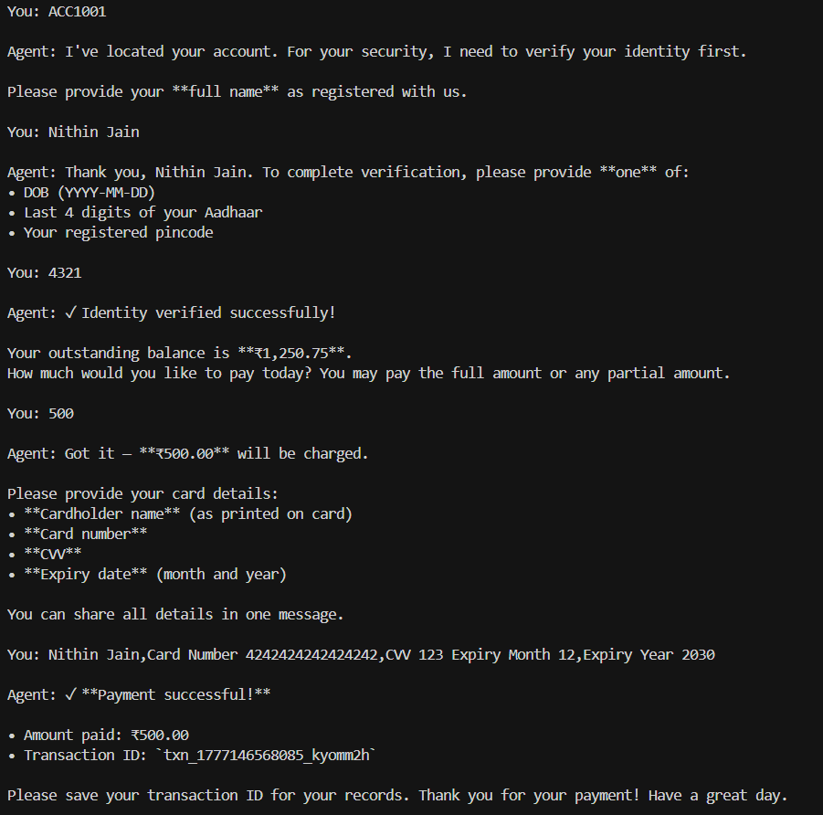
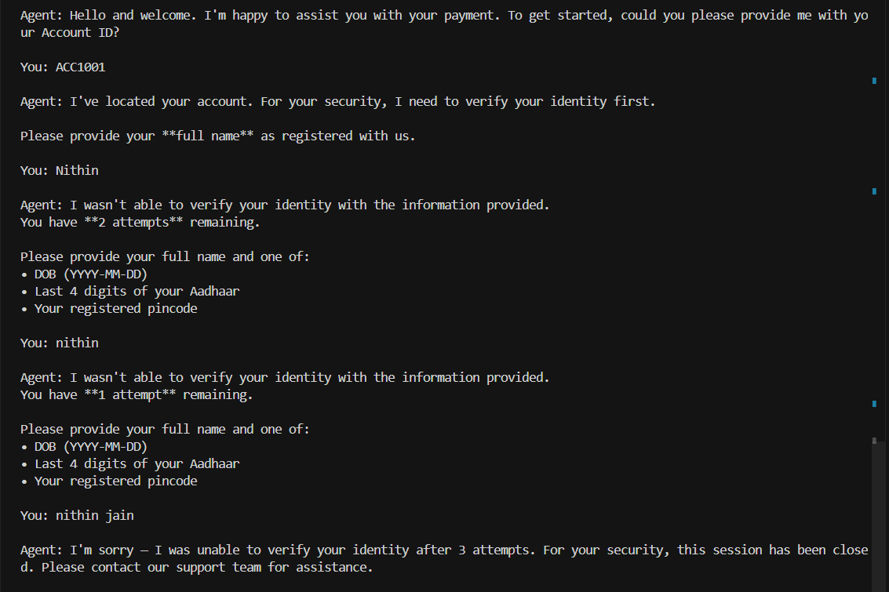
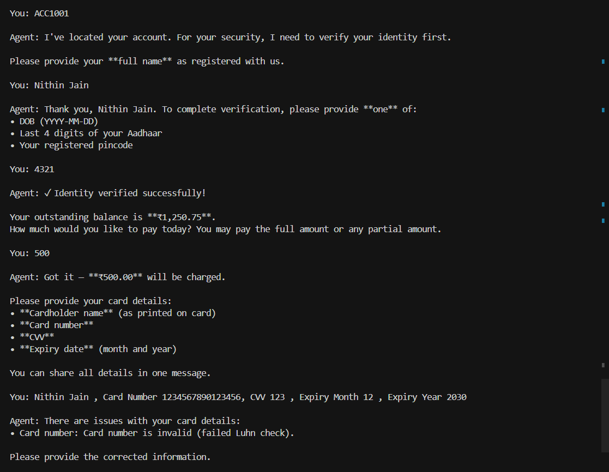
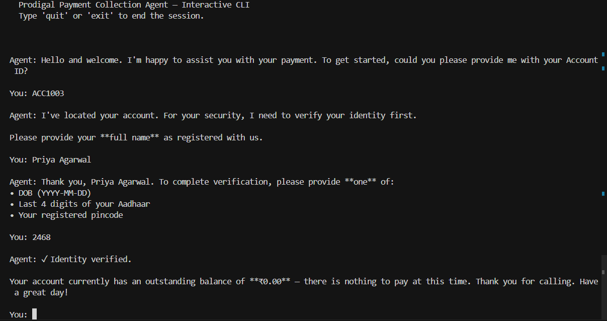

# Payment Collection AI Agent

A production-ready conversational AI agent that handles an end-to-end payment collection flow, built for the Prodigal Agent Engineer take-home assignment.

---

## Project Structure

| File | Purpose |
| --- | --- |
| `agent.py` | Required `Agent.next()` interface and core agent/state machine logic |
| `tools.py` | API client wrappers (`lookup-account`, `process-payment`) |
| `validators.py` | Validation logic (Luhn, CVV, expiry, identity, amount) |
| `main.py` | Interactive CLI runner |
| `evaluate.py` | Automated evaluation suite |
| `requirements.txt` | Python dependencies |
| `design_document.md` | Architecture, decisions, tradeoffs, assumptions |
| `.env` | Local configuration (`GROQ_API_KEY`) |

---

## Setup

### 1. Clone / download the repository

```bash
git clone <repo-url>
cd prodigal_assignment
```

### 2. Create and activate a virtual environment (recommended)

```bash
python -m venv my_venv
# Windows
my_venv\Scripts\activate
# macOS/Linux
source my_venv/bin/activate
```

### 3. Install dependencies

```bash
pip install -r requirements.txt
```

### 4. Configure environment variables

Create a `.env` file in the project root:

```
GROQ_API_KEY=your_groq_api_key_here (or if using any other LLM provider,adjust accordingly)
```

---

## Running the Agent

### Interactive CLI

```bash
python main.py
```

Type your messages and press Enter. Type `quit` or `exit` to end the session.

### Programmatic Usage (required interface)

```python
from agent import Agent

agent = Agent()
print(agent.next("Hi"))
# → {"message": "Hello! Please share your Account ID to get started."}

print(agent.next("ACC1001"))
# → {"message": "I've located your account. Please provide your full name..."}
```

---

## Running the Evaluation Suite

```bash
python evaluate.py
```

This runs **15 test scenarios** automatically and prints a per-turn report + overall summary. Results are also saved to `eval_results.json`.

On Windows PowerShell, use UTF-8 mode to avoid Unicode console issues with checkmark/cross symbols:

```powershell
$env:PYTHONUTF8='1'; python evaluate.py
```

---

## Test Accounts

| Account ID | Full Name                      | DOB        | Aadhaar Last 4 | Pincode | Balance    |
|------------|--------------------------------|------------|-----------------|---------|------------|
| ACC1001    | Nithin Jain                    | 1990-05-14 | 4321            | 400001  | ₹1,250.75  |
| ACC1002    | Rajarajeswari Balasubramaniam  | 1985-11-23 | 9876            | 400002  | ₹540.00    |
| ACC1003    | Priya Agarwal                  | 1992-08-10 | 2468            | 400003  | ₹0.00      |
| ACC1004    | Rahul Mehta                    | 1988-02-29 | 1357            | 400004  | ₹3,200.50  |

---

## Terminal Run Screenshots(for different scenerios) --> 

After running `python main.py`, capture terminal screenshots and place them in `assets/screenshots/`.

### 1. Successful End-to-End Payment



### 2. Verification Failure (Retries Exhausted)



### 3. Payment Failure (Invalid Card)



### 4. Zero Balance Flow



---

## Architecture Overview

See `design_document.md` for full architecture.
---

## 3) Evaluation Approach

### Test coverage and scenario design
The automated suite in `evaluate.py` includes 15 scenarios that intentionally cover:
- **Happy paths:** full and partial successful payments.
- **Verification failures:** wrong name/identity combinations and retry exhaustion leading to session closure.
- **Payment failures:** invalid card number (Luhn), expired card, and amount-related invalid requests.
- **Edge cases and ambiguity handling:** zero balance account, leap-year DOB, very long name matching, and out-of-order user inputs.

### Correctness criteria (what "correct" means)
Correctness is measured **turn-by-turn** using deterministic expectations:
- For each user turn, the agent response must include all required expected keywords for that step (case-insensitive keyword check).
- A turn is marked pass only if all expected signals are present (e.g., prompt for next required field, verified state acknowledgement, payment success/failure reason, or session-close behavior).
- A scenario is marked pass only when **all** turns in that scenario pass.
- Overall correctness is summarized as both scenario-level pass rate and turn-level pass rate.

### Automated evaluation script
- Script: `evaluate.py`
- Command: `python evaluate.py`
- Output:
  - Per-turn pass/fail logs with missing keywords (if any)
  - Per-scenario summary
  - Overall summary
  - Persistent JSON report at `eval_results.json`

### Observations and current limitations
- The agent performs strongly on the deterministic flows included in the 15 scripted scenarios.
- The biggest evaluation limitation is **keyword-based grading**: semantically correct paraphrases may be marked as failures if expected keywords are absent, and keyword presence can occasionally over-credit a weak response.
- Real-world robustness beyond this suite can still degrade for highly adversarial phrasing, noisy mixed-intent inputs, or unusual formatting not represented in current scenarios.
- A next improvement is semantic grading plus adversarial fuzz tests to better measure conversational robustness.
---
