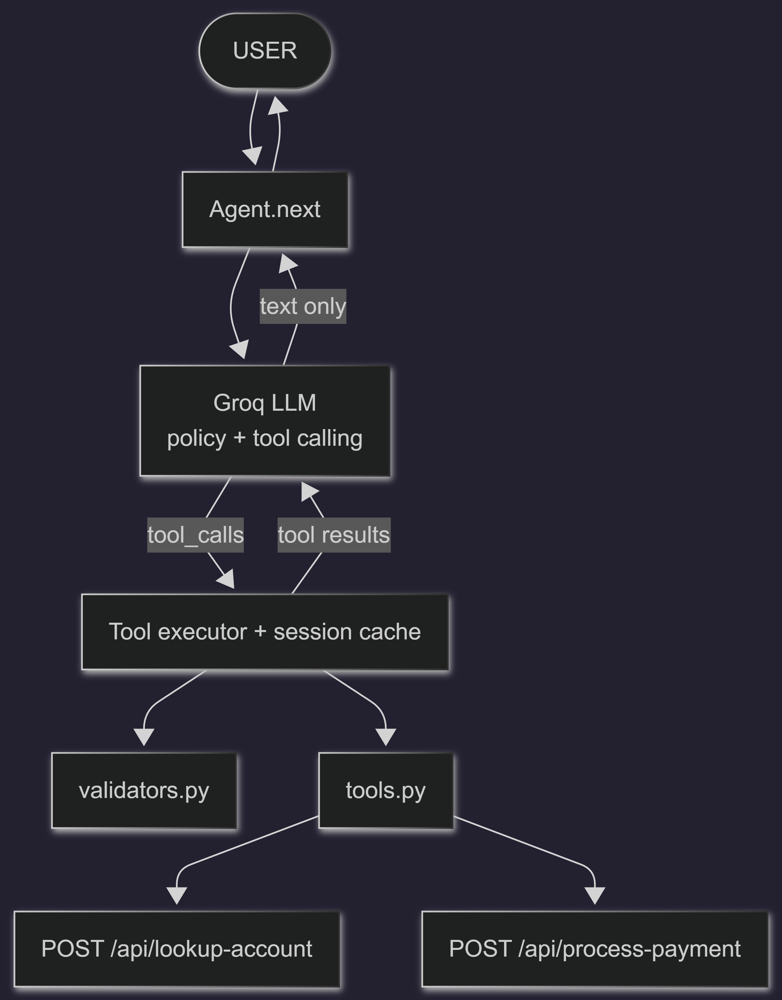
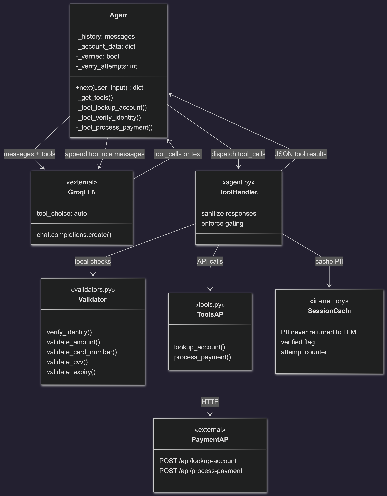

# Submission Note — Payment Collection AI Agent
**Date:** 2026-04-26

## 1) Architecture selected:
Pure LLM-Driven Tool-Calling Architecture (Agentic).
The previous Deterministic State Machine (DSM) architecture enforced strict routing in Python. This has been fully migrated to an LLM-driven tool-calling paradigm to provide greater conversational flexibility while maintaining structured interactions with external APIs.
- The LLM orchestrates the entire flow, reasoning about what to do next based on the strict policy in the system prompt.
- The Python code acts as an execution shell that exposes core `tools` to the LLM (`lookup_account`, `verify_identity`, `process_payment`).
- Crucially, security is maintained by caching sensitive PII (like name and DOB) in Python memory rather than returning it to the LLM. The LLM only receives a sanitized success response from `lookup_account`.

### High-level architecture diagram


## 2) Implementation
The implementation relies heavily on the LLM's native function-calling capabilities. `Agent.next()` maintains the conversation history and enters a loop:
1. Call the LLM with the latest user input and a list of available tools.
2. If the LLM generates a tool call, execute the wrapped Python function (which handles security, caching, and local validation).
3. Return the sanitized tool execution result to the LLM and loop again until the LLM yields a natural language response.

### Implementation architecture diagram




## 3) Final Verdict (eval + readiness)
Evaluation results in this repository show full pass:
- 15/15 scenarios
- 53/53 turns
- 100% overall

For assignment scope, this solution is production-ready: deterministic policy-critical flow is enforced in code, conversational flexibility is retained through constrained LLM use, and error/edge-case handling is comprehensively covered by automated evaluation.

This score reflects full pass on the current deterministic keyword-based evaluation suite; broader robustness can be measured with semantic grading and adversarial tests.

## 5) How to Reproduce Evaluation

```powershell
$env:PYTHONUTF8='1'; python evaluate.py
```

Run with UTF-8 on Windows PowerShell to avoid Unicode display issues.

For non-Windows shells:

```bash
python evaluate.py
```

